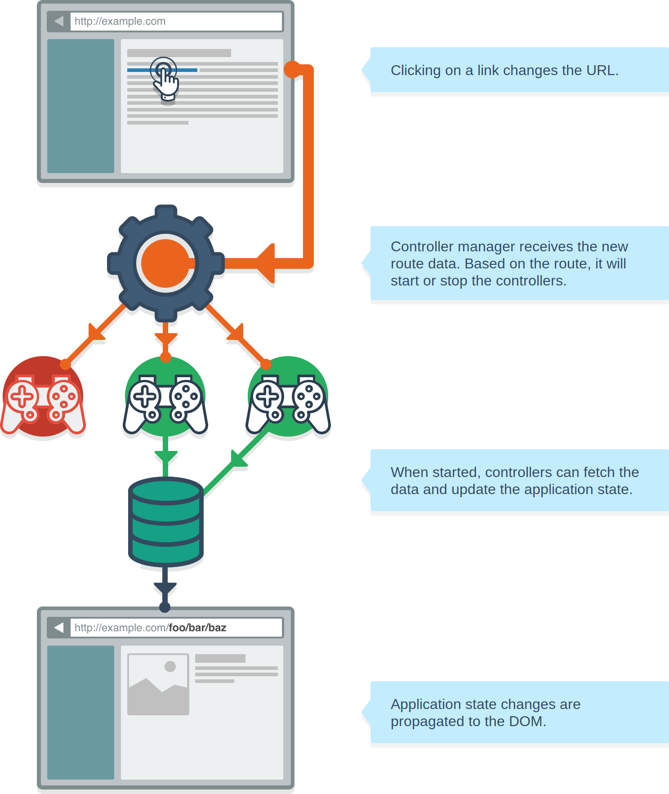
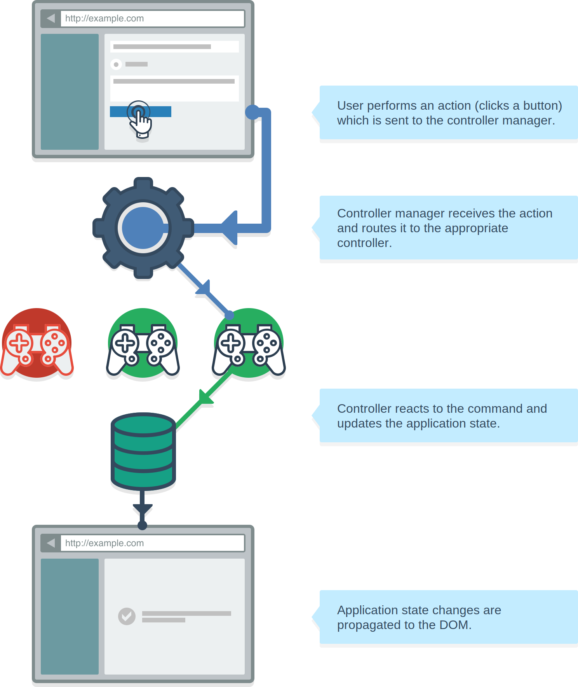

# Introduction to Keechma

Keechma implements a set of utilities that make it easier to develop predictable, consistent and deterministic applications.

## Glossary

- **Application**: combination of the routes, controllers, components and subscriptions that work together as a unit. Application state is stored in the internal atom.
- **Routes**: a list of route patterns that describe how to transform URL to the data and data to the URL.
- **Controller Manager**: internal part of the application that starts or stops controllers based on the current route params.
- **Controllers**: Clojure records that implement the `controller/IController` protocol. They are managed by the controller manager. Controllers are responsible for the following:
    1. When started they (can) mutate the application state and load the data.
    2. When stopped they (can) mutate the application state and clean up the loaded data.
    3. When the user sends a command (e.g. by clicking on button) it is routed to the appropriate controller which reacts to the command and mutates the application state accordingly.
- **Subscriptions**: functions that return a subset of the application state to the UI components.
- **Entity DB**: stores the application entities.
    + Entites of the same type with the same identity will be stored only once and referenced from the collections or named item slots.
    + When subscriptions query the Entity DB they get the real entities back (based on the collection name or named item slot).
    + Entity state in the Entity DB is be automatically propagated to all collections or named item slots that reference that entity.
- **UI component system**: a set of utilites that allow you to write decoupled, reusable components. Each component declares it's dependencies which are injected to the component when the application is started.

## The flow

There are two ways to affect the application state:

1. URL change
2. UI action (e.g. clicking on a button) which sends the command to the controller

### URL change flow

1. When the URL changes, the router will transform the URL into the map that represents the data contained in the URL.
2. The route params map will be sent to the controller manager which will then start or stop the controllers accordingly. 
3. Each controller can mutate the application state
4. Application state changes are propagated to the UI

### UI action flow

1. When the user performs an action (e.g. clicks on a button) the command is sent to the controller manager.
2. Controller manager routes the command to the appropriate controller (based on the command `:topic`)
3. Controller reacts to the command and mutates the application state
4. Application state changes are propagated to the UI

---

The code that mutates the application state is always placed in the controllers. Controllers are the only place in the application where you have the access to the application state.

## Credits and Inspiration

The libraries that had the biggest impact on Keechma:

- [CanJS](http://canjs.com) - Keechma's router is ported from CanJS and EntityDB is inspired by the CanJS model store
- [Re/Frame](https://github.com/Day8/re-frame). - One-big-atom store, subscriptions and handlers are based of my experience with Re/Frame
- [Reagent](https://github.com/reagent-project/reagent) - Keechma would be much harder to implement without Reagent's approach to components
- [Om](https://github.com/omcljs/om) - Without Om I probably wouldn't try ClojureScript, so Keechma wouldn't exist.

