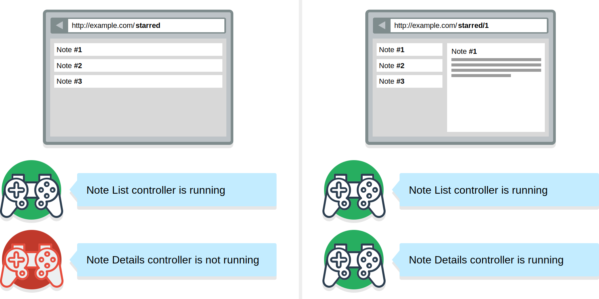

# Controllers

Controllers in Keechma react to route changes and implement any code that has side effects.

- Controllers make AJAX requests.
- Controllers mutate the application state
- Controllers can connect to web sockets and react to received messages, etc.

Anything that produces a side effect is implemented in a controller. Controllers are the only place in the application where you have the access to the application state atom.

For each URL you can have multiple controllers running at once, each one managing a substate of the application. This way you can split the application logic in small pieces, with clearly defined responsobilites.

## How controllers work

Each controller is implemented as a Clojure record which implements the `controller/IController` protocol. This protocol defines multiple functions, but right now we're only interested in the `params` function.

`params` function receives the route params and returns the subset of params that are needed for the controller to run or `nil`. Controller Manager relies on the return value from the `params` function to decide if the controller should be started, stopped or left alone.

Whenever the URL changes, the manager controller will do the following:

1. It will call `params` function of all registered controllers
2. It will compare returned value to the last returned value (returned on the previous URL change)
3. Based on the returned value it will do the following:
    1. If previous value was `nil` and current value is `nil` it will do nothing
    2. If previous value was `nil` and current value is not `nil` it will start the controller
    3. If previous value was not `nil` and current value is `nil` it will stop the controller
    4. If previous value was not `nil` and current value is not `nil` but those values are same it will do nothing
    5. If previous value was not `nil` and current value is not `nil` but those values are different it will restart the controller

### An example

Let's say you have to implement a note application (similar to Evernote). You have two URLS:

1. A URL that takes you to the list of notes
2. A URL that will show the list of notes and a detailed view of the selected note.

The routes could look like this:

```clojure
(def routes [":page"
             ":page/:note-id"])
```

- When the user goes to the URL `/starred` the params received by the Controller Manager would be `{:page "starred"}`
- When the user goes to the URL `/starred/1` the params received by the Controller Manager would be `{:page "starred" :note-id 1}`

Since we need to show the list of notes on both URLs, the `NoteList` controller should just care about the `:page` param:

```clojure
(defrecord NoteList[]
    controller/IController
    (params [_ route-params]
        (get-in route-params [:data :page])))
```

The `NoteList` controller's params function ensures that it will be running on each url that has the `:page` param.

The `NoteDetails` controller should run only when the `:note-id` param is present:

```clojure
(defrecord NoteDetails[]
    controller/IController
    (params [_ route-params]
        (get-in route-params [:data :note-id])))
```

When the user is on the `/starred` page the `NoteDetails` controller will not be running. It will run only on the `/starred/1` URL. 

<div class="diagram"></div>

When using the controllers to manage the application state mutations you can ensure the following:

1. State changes will be determenistic.
    - Based on the route, you know which controllers are running on the page.
2. Data is loaded at the right time, when the controller is started.
3. Domain logic is split into small, bite sized parts, each controller implements only the subset of the page logic.

**Controllers in Keechma are future proof**, if the UI layout was changed, and the note details page doesn't show the list of the notes anymore, the only thing that you would need to update is `NoteList` controller's `params` function, everything else would remain the same.

If React allows you to reason about your app like you're re - rendering everything every time something changes, **Keechma controllers' goal is to allow you to reason about your app like you're reloading everything every time the URL changes**.

## Handling the user actions

Besides the data loading, controllers have another task. They react to user commands.

Whenever the user performs an action - clicks on a button or submits a form, that action is sent to the Controller Manager. Based on the `:topic` this action will be routed to the appropriate controller.

Each controller can implement the `handler` function. That function receives the `in-chan` as an argument. User commands will be placed on that channel, and the controller can take from the channel and react to the command.

```clojure
(defrecord UserController []
    controller/IController
    (handler [_ app-db in-chan __]))
    ;; Commands will be placed on the `in-chan` which is passed into the handler function
```

UI components don't define the `:topic` at the sending time, it is globally set for each UI component.

```clojure
(defn renderer [ctx]
    [:button {:on-click #(ui/send-command ctx :reload-user)} "Reload User"])
;; Define a (Reagent) component that sends the command

(defn button-component (ui/constructor {:renderer renderer
                                 :topic :user})
;; Set up the component
```

When you define the application config map (which will be used to start and stop the application), you register each controller under the `key`. This key will be used as a `:topic` on which the controller will listen to commands.

```clojure
(def app-config {:controllers {:user UserController}
                 ;; UserController will listen on the `:user` topic
                 :components {:main button-component}})
```

Controllers can only receive the commands if they are currently running. Otherwise the command will be dropped.

Read the API docs for the [Controller Manager](api/keechma.controller-manager.html) and for the [Controllers](api/keechma.controller.html).