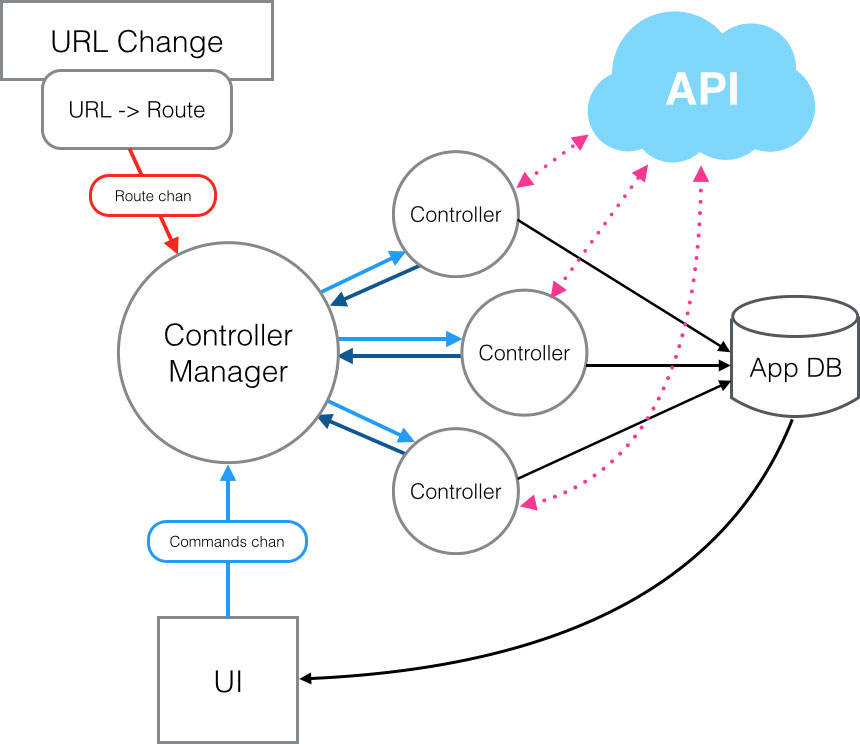

# Architecture Overview

Architecture of a Keechma app looks like this:

- Route changes are communicated through the route channel to the controller manager
    + Based on the route controller manager will start or stop controllers
- Controllers have `in-chan` and `out-chan` which they can use to communicate with the world (they can send messages to other controllers).
- Controllers can change the app-db which will trigger the re-rendering of the app
- UI communicates with the controllers by sending messages through the `commands-chan`. Those messages get routed to the controller (based on the topic) which receives them through the `in-chan`
